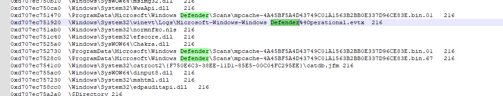

# Awam

spitfire

---

## Flag

```
ARA5{always_blame_the_user_when_an_incident_occurred_kappa}
```


## Description
Sebuah device membunyikan alert malware ke sistem! Nama penggunanya adalah Aditya Perkasa, seorang karyawan baru. Dia mengaku tidak melakukan apa-apa di dalam device kantor yang dimilikinya. Apakah benar? (Extracted file size: 8GB)

## Difficulty
hard

## Hints

## Tags
memory forensics, windows forensics

## Notes
Jika file di-host di cloud, usahakan untuk membagikannya sebelum CTF dimulai. File telah dipassword dengan pass tertera di `passarchive.txt`

File: https://drive.google.com/file/d/1PKW3ZmbytgRgqaLb_AM1M4ZQWxoUqBSy/view?usp=drive_link
## Solution
1. Apa nama email dari pengirim yang mengirimkan malware tersebut?
(Format: email@domain.tld)

Email dapat discrape dari file memory yang disediakan. Jika diperhatikan, hanya 1 email, malik.abdul28295[at]gmail.com yang sering terlihat dalam artifact sebagai XML dari sebuah email.


Answer: `malik.abdul28295gmail.com`

2. Path lengkap dari malware yang didownload? (Format: Drive:\path\to\the\file.ext)

Dari berbagai artifact, misal dari LECmd atau Event Log, terlihat bahwa file yang didownload adalah gametest.zip, yang berlokasi di `C:\Users\adity\Downloads\gametest.zip`.

Answer `C:\Users\adity\Downloads\gametest.zip`

3. Menurut antivirus yang ada, apa nama dari ancaman yang terdeteksi? (Format: Type:Architecture/Name)

Umumnya aktivitas antivirus, dalam hal ini Windows Defender, dapat dilihat di Event Log. Jika melihat ke artifact memory dengan filescan, akan terlihat salah satu file yang dicache adalah Microsoft-Windows-Windows Defender%4Operational.evtx. Dump file ini dengan

`python3 vol.py -f file.raw windows.dumpfiles –virtaddr 0xd707ec751920`



Namun jika file ini dibuka secara manual, akan muncul error bahwa file corrupt. Hal ini normal karena memory untung-untungan dalam melakukan caching file di dalam memory. Tapi uniknya, jika dibuka manual, file yang dicarve masih memiliki ElfChnk, signature dari eventlog chunk yang berisikan satu buah event.


Di sini perlu dibuat script untuk parsing EVTX chunks yang ada di dalam hasil carving.
Tidak perlu terlalu rumit, cukup script sederhana dengan library `python-evtx`.


Setelah diprint, bisa dipipe ke file TXT dan dianalisis isinya.
Di bagian akhir EVTX sebelum corrupt terdapat log deteksi Windows Defender yang lengkap dengan Threat Name sebagai jawabannya.


Answer: `Trojan:Win32/Trickbot!ml`

4. Menurut artifact yang tersedia, kira-kira pada waktu berapa user menginisiasi malware ini? (UTC) (Format: YYYY-MM-DD HH-MM)

Salah satu cara untuk melihat user-initiated execution, adalah melalui LNK file yang dibuat di Recent Files.
Lokasi dari Recent Files biasanya `%APPDATA%\Roaming\Microsoft\Windows\Recent\*.lnk.`
Dari hasil plugin filescan, terdapat file recent bernama gametest.lnk.


Extract file tersebut, kemudian parse dengan menggunakan LECmd dari Eric Zimmerman.

Hasil LECmd dari \Users\adity\AppData\Roaming\Microsoft\Windows\Recent\gametest.lnk:


[Reference](https://www.thedfirspot.com/post/a-lnk-to-the-past-utilizing-lnk-files-for-your-investigations)

Answer: `2024-01-19 13:05`

5. Sepertinya password archive dikirimkan melalui medium yang berbeda. Apa password dari malware yang dikirimkan oleh pelaku tersebut? Format: (password)

File ini sebenarnya dapat diambil dari temp folder yang dapat dilihat di output `filescan` Volatility3.


File ini dapat diextract (terdapat beberapa error tapi file masih bisa dibuka). File ini dapat kita coba crack dengan `fcrackzip`, `john`, atau `hashcat` + `rockyou.txt` karena password yang sederhana.


Answer: `infected`