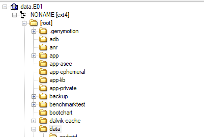
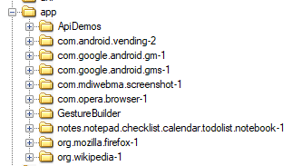
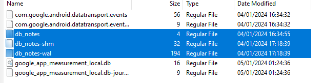
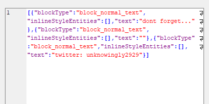
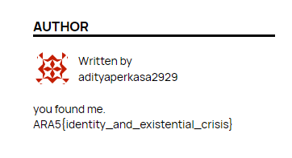

# The Mystery of the Druid

spitfire

---

## Flag

```
ARA5{identity_and_existential_crisis}
```

## Description
“Women like blogs, Halligan.”

## Difficulty
Medium

## Hints
1. Flag tidak ada di dalam evidence.
2. Ada 4 langkah:
- Lakukan ________
- Dapatkan ________ dengan _________
- Temukan ________
- Cek _________

## Tags
android forensics, OSINT

## Notes
File: https://drive.google.com/file/d/1tvVDWIQ0KA1-pKhkYAeRAXZs9F0Tu-VY/view?usp=drive_link

## Solution

Terdapat 4 langkah:
1. Lakukan analisa terhadap file E01 yang mana merupakan filetype acquisition dari FTK Imager. Dari sini kita bisa eksplorasi aplikasi apa saja yang dipasang. Aplikasi yang dipasang manual atau bukan bawaan biasanya berbentuk APK dan ditaruh di /app, jadi fokuskan pencarian ke aplikasi yang dipasang oleh user. Di sini ada 4 aplikasi, Opera, Firefox, Wikipedia, dan Notes.


2. Setelah eksplorasi, interesting item berada di Notes. 3 file yang perlu diextract adalah db_notes, file yg berisikan konten dari app notes tersebut. Jangan lupa untuk juga mengekstrak -shm dan -wal karena untuk mendapatkan konten “terkini”, ketiga file tersebut perlu ada di folder yang sama agar file db_notes yang merupakan sqlite dapat terupdate ke konten paling recent.

3. Salah satu notes tersebut adalah twitter dari Aditya, si pemilik ponsel ini.
Jika dicek langsung ke twitter, akan terlihat bahwa dia memiliki blog.

4. Blog yang dimaksud adalah blog wordpress. Akses wordpress dia di `adityalifeupdate.wordpress.com`

5. Di buka salah satu post dari author adityaperkasa, kemudian temukan flagnya.
